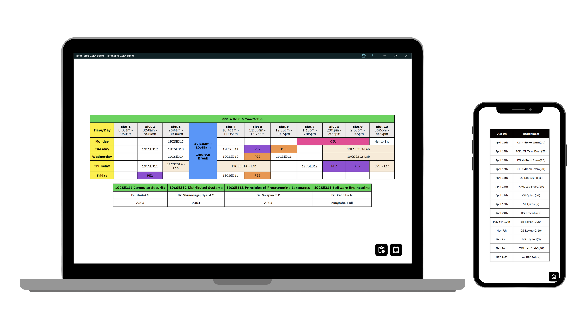
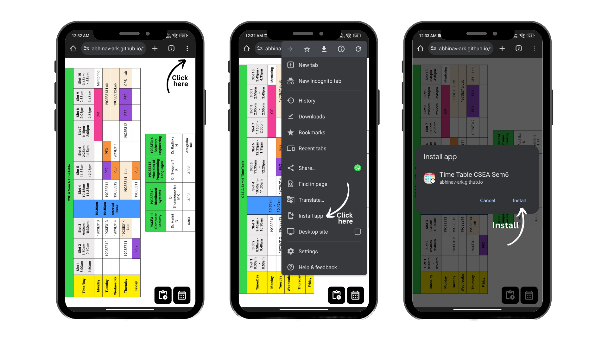
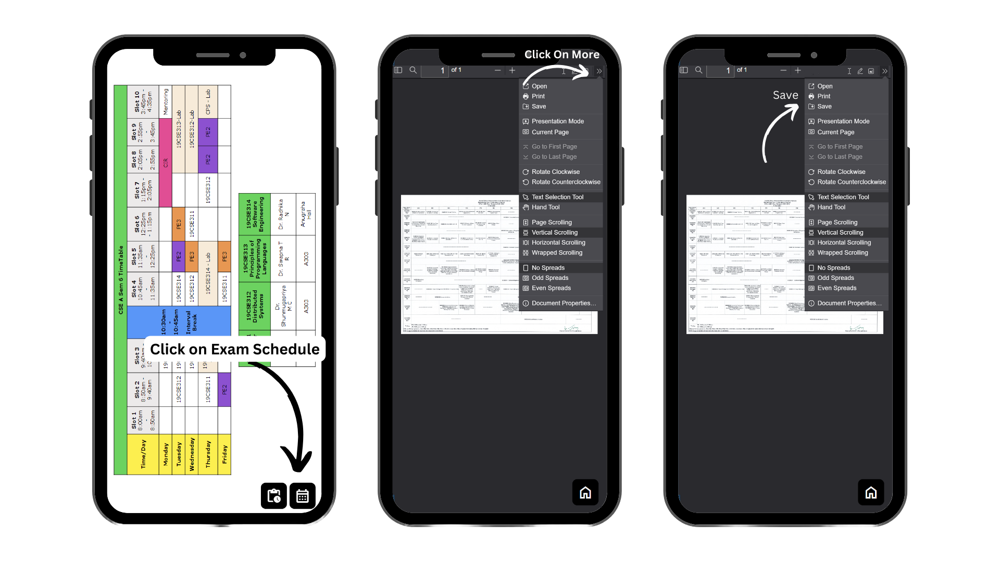

# Timetable B.Tech CSE A Progressive Web App

- Simple PWA to display timetable for 6th Semester 2023-24 B Tech CSE A.
- Built with
    - `HTML5`
    - `CSS3`
    - `JavaScript`
 
## Features

- [x] Time Table with Course Code and Slots.
- [x] Tasks Table and Exam Schedule PDF Reader.
- [x] Responsive Design.
- [x] PWA (Can be installed on Android, iPhone and Desktop).

 
 

# Installation Steps

 

    <a href="https://abhinav-ark.github.io/timetable_csea/">Install App</a>

 
 

# Steps to Download Exam Timetable

 

# Motivation 
  Our classmates used to change the class whatsApp group's DP to a screenshot of the timetable to keep track of it on a regular basis. One day when I was trying to update the classgroup's DP to the new timetable, the quality of the image was unusable (text not readable) due to whatsApp's compression algorithms. I created a static HTML page of the timetable and added a manifest.json, hosted it on GitHub pages and updated it in the class group's description that evening. That simple pwa evolved into the one available today.  

## Contributors

- `Abhinav Ramakrishnan`
- `Ashwin Narayanan S`
- `Hariharan A`

 

> If You Want to suggest a change in tasks you can either raise an Issue (or) fork the repository, commit changes and create a Pull Request.

# Attributions
- `App Icon`: Calendar icons created by Freepik - Flaticon
- `PDF Viewer`: [PDF.js](https://github.com/mozilla/pdf.js) by Mozilla Foundation Under [Apache-2.0 License](https://github.com/mozilla/pdf.js/blob/master/LICENSE)

# Licensing
- All Code In [`./Assets/pdfjs-4.0.379-dist`](./Assets/pdfjs-4.0.379-dist) Directory is Licensed Under [Apache-2.0 License](https://github.com/mozilla/pdf.js/blob/master/LICENSE), [MOZIILA'S CODE OF CONDUCT](https://github.com/mozilla/pdf.js/blob/master/CODE_OF_CONDUCT.md)
- All Code Except [Assets](./Assets) Directory is Licensed Under [MIT License](https://github.com/Abhinav-ark/timetable_csea/blob/main/LICENSE)
